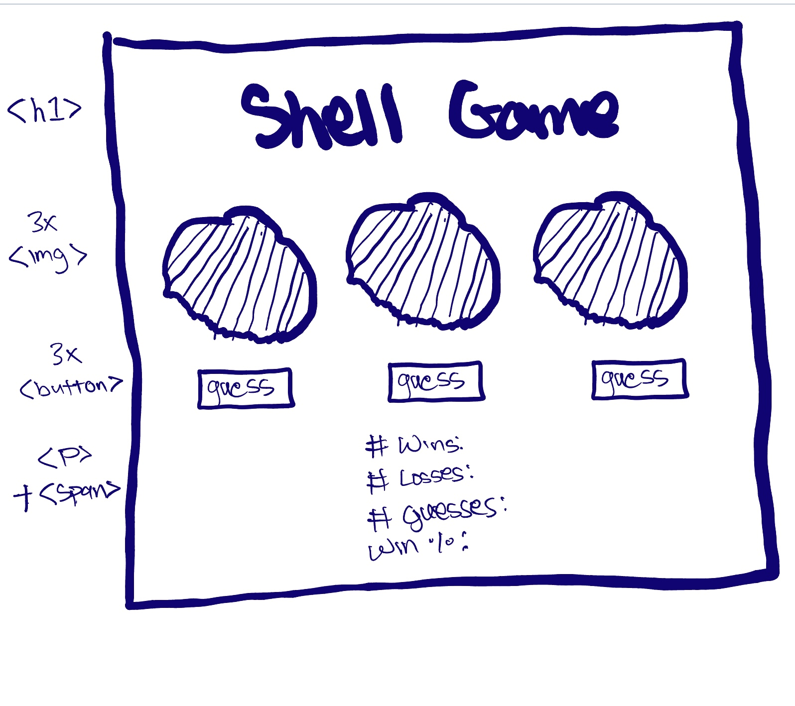

# HTML List

-   h1 element for title
-   section containing 3x images of shells
-   section containing 3x guess buttons each tied to a specific shell
-   temporary ball and shell image to display after a guess (or maybe something done in css instead)
-   p element for # of wins + span element
-   p element for # of losses + span element
-   p element for # of guesses + span element
-   p element for win percentage + span element

# DOM
